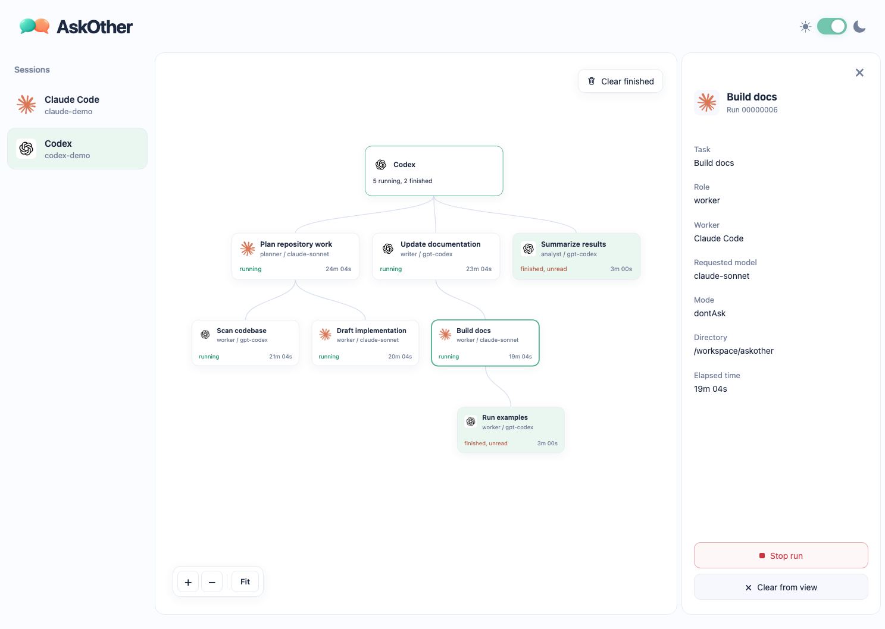

<p align="center">
  
</p>

<h1 align="center">AskOther</h1>

<p align="center">
  <strong>Let Claude Code and Codex ask each other for help.</strong><br />
  A second opinion, a review, or a hand with the work, from the session you already use.
</p>

<p align="center">
  <a href="#get-started">Get started</a> ·
  <a href="#what-you-can-ask">What you can ask</a> ·
  <a href="USAGE.md">Usage and settings</a>
</p>



AskOther is one small program. Your agent starts the other agent, waits for it to finish, and reads its answer, and you can follow up or stop it at any time. Run `askother ui` to watch every run in your browser.

## Get started

**macOS or Linux**, with Go 1.26 or newer and Claude Code or Codex.

Paste this to your agent:

```text
Set up AskOther from https://github.com/alex2481kobe/askother.
Install it with: go install github.com/alex2481kobe/askother/cmd/askother@latest
Then run `askother help` and follow its Setup section to register it
with Claude Code and Codex, whichever I have. Also copy the repo's
skills/askother folder into their skills folders.
Tell me when to start a new session.
```

Prefer to do it yourself? See [setup by hand](USAGE.md#set-up-by-hand).

## What you can ask

In a new session, copy a prompt:

```text
Ask Codex to review this change and tell me what it finds.
```

```text
Ask Claude Code for a second opinion on this plan before we start.
```

```text
Have Codex write the tests for this function while you keep going,
then show me what it wrote.
```

## Works with

Claude Code and Codex, in the terminal and in their desktop apps (with the `claude` and `codex` command line tools installed). Other CLI agents can be added with an adapter, and a Jev adapter is planned.

Apache-2.0. The Claude Code and Codex icons in the UI belong to Anthropic and OpenAI and only label which worker is which.
